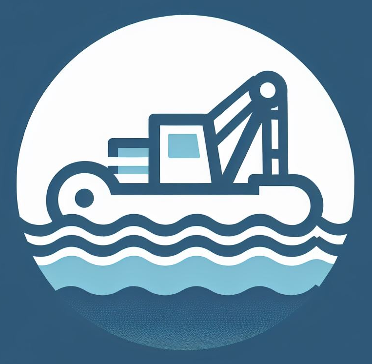

# Dredge: A Container Registry Client CLI

Dredge is a CLI built on .NET that provides a simple way to execute commands on a container registry's HTTP API. Currently, only read operations are supported.

## Features

* Access to raw JSON data from the registry's HTTP API.
* Extended, derived data such as [image configuration](docs/commands/images.md#inspect-image-configuration), [OS information](docs/commands/images.md#image-os-information), and comparison of [layers](docs/commands/images.md#compare-image-layers) and [files](docs/commands/images.md#compare-image-files).

### Documentation

The main documentation is in the [docs](docs) directory.

## Install

### Installing as a standalone executable

Download the desired executable from the [release page](https://github.com/mthalman/dredge/releases).

Prerequisites:
* [.NET 9 runtime](https://dotnet.microsoft.com/download/dotnet/9.0)

### Running as a container

```shell
docker run --rm ghcr.io/mthalman/dredge --help
```

### Installing as a .NET global tool

```console
> dotnet tool install -g Valleysoft.Dredge
```
