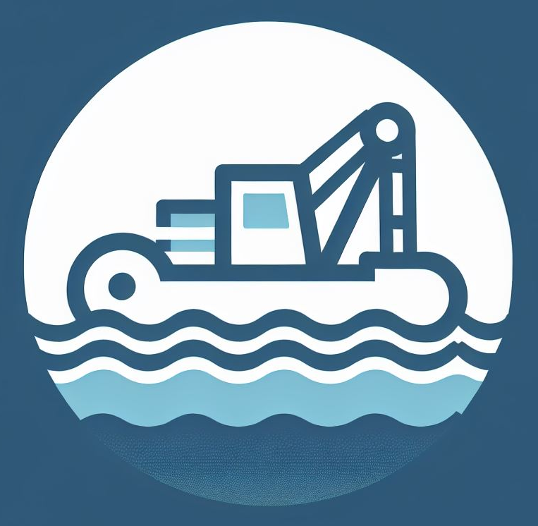

# Dredge

A .NET CLI for querying container registry HTTP APIs ([OCI Distribution Spec](https://github.com/opencontainers/distribution-spec)). All operations are read-only.

## Features

* Query raw JSON data from registry APIs — [manifests](docs/commands/manifests.md), [tags](docs/commands/tags.md), [repositories](docs/commands/repositories.md), and [referrers](docs/commands/referrers.md).
* Inspect [image configuration](docs/commands/images.md#inspect) and [OS information](docs/commands/images.md#os).
* Compare image [layers](docs/commands/images.md#compare-layers) and [files](docs/commands/images.md#compare-files) across versions.
* [Generate Dockerfiles](docs/commands/images.md#dockerfile) from existing images.
* [Save image layers](docs/commands/images.md#save-layers) to disk (squashed or individual).
* [Platform resolution](docs/platform-resolution.md) for multi-arch images.

📖 Full documentation is in the [docs](docs) directory.

## Install

### Standalone executable

Download from the [release page](https://github.com/mthalman/dredge/releases).

Prerequisites:
* [.NET 10 runtime](https://dotnet.microsoft.com/download/dotnet/10.0)

### Container

```shell
docker run --rm ghcr.io/mthalman/dredge --help
```

### .NET global tool

```console
dotnet tool install -g Valleysoft.Dredge
```
