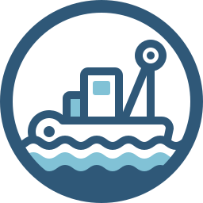
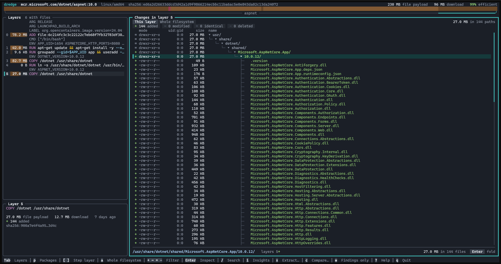

# Dredge

Dredge is a .NET command-line tool for exploring container images and interacting
with container registries through the HTTP APIs defined by the
[OCI Distribution Specification](https://github.com/opencontainers/distribution-spec).

## Explore images in your terminal

See what is inside an image, which layer put it there, and where space is wasted.
Dredge's full-screen explorer brings layers, files, packages, and comparisons
together in one keyboard- and mouse-driven view.



```console
dredge image explore mcr.microsoft.com/dotnet/aspnet:10.0
```

- **Follow changes through layers.** Browse each layer or the cumulative
  filesystem, search paths, and inspect file history with text previews and diffs.
- **Find wasted space.** Use efficiency insights to locate files replaced or
  deleted by later layers but still shipped in the image.
- **Compare images and packages.** Compare another tag's filesystem and package
  inventory, then drill into changed files.

See the [explorer guide](docs/commands/images.md#explore).

## Features

- Query raw JSON data for [manifests](docs/commands/manifests.md),
  [tags](docs/commands/tags.md), [repositories](docs/commands/repositories.md),
  and [referrers](docs/commands/referrers.md).
- Delete [tags](docs/commands/tags.md#delete) or
  [manifests](docs/commands/manifests.md#delete) from registries that support deletion.
- Inspect and retrieve OCI artifacts or check for required artifact types in CI.
- Inspect an image's [configuration](docs/commands/images.md#inspect) and
  [operating system information](docs/commands/images.md#os).
- [Explore a Linux image interactively](docs/commands/images.md#explore):
  walk its layers, find wasted space, and compare it with another tag.
- Browse, read, and selectively [extract files from Linux
  images](docs/commands/images.md#ls) with layer provenance.
- Compare [layers](docs/commands/images.md#compare-layers) or
  [files](docs/commands/images.md#compare-files) between images.
- [Generate a Dockerfile](docs/commands/images.md#dockerfile) from an image.
- [Save image layers](docs/commands/images.md#save-layers) as a merged
  filesystem or as separate directories.
- Select a platform from a multi-platform image through
  [platform resolution](docs/platform-resolution.md).

See the [Dredge documentation](docs/README.md) for the complete command
reference and configuration guides.

## Install Dredge

Choose one installation method.

### Release executable

Download from the [release page](https://github.com/mthalman/dredge/releases).
Select the executable for your operating system and architecture.

The release executable requires the
[.NET 10 runtime](https://dotnet.microsoft.com/download/dotnet/10.0).

### Container

```shell
docker run --rm ghcr.io/mthalman/dredge --help
```

When following command examples, replace `dredge` with
`docker run --rm ghcr.io/mthalman/dredge`. Add `-it` to `docker run` when using
the interactive explorer.

### .NET global tool

Install the [.NET 10 SDK](https://dotnet.microsoft.com/download/dotnet/10.0)
before installing or updating the tool.

```console
dotnet tool install -g Valleysoft.Dredge
```

## Query a registry

Query the manifest digest of a public image:

```console
dredge manifest digest alpine:latest
sha256:...
```

If the registry requires credentials, see
[Authenticate to a registry](docs/authentication.md).
